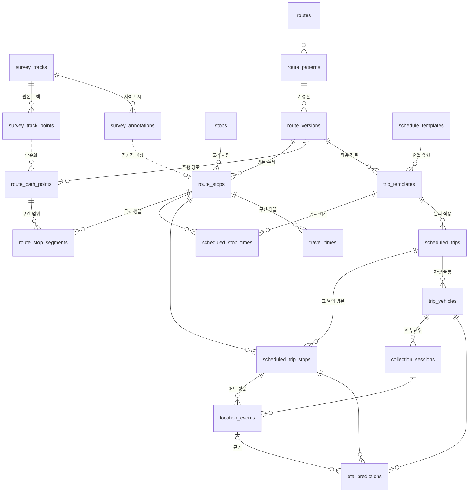
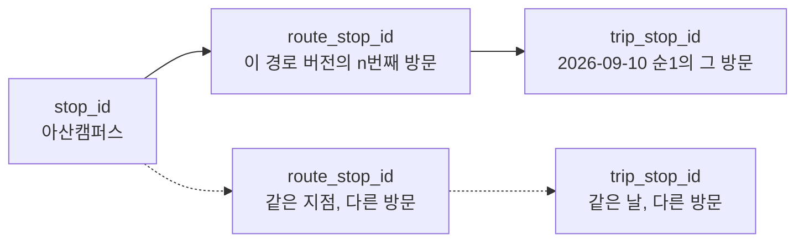

# 15 · 데이터 구조

> 각 문서가 정의한 테이블을 한 장에 모아 **관계와 소유**만 보여준다.
> 열 정의와 규칙은 소유 문서에 있다. 여기서 다시 정의하지 않는다.
> 참조: [공통 규약](01-conventions.md) · [기준 데이터](04-reference-data.md)

이 문서는 **지도**다. 새 규칙을 만들지 않으며, 소유 문서와 어긋나면 소유 문서가 기준이다.

---

## 1. 다섯 층

데이터는 한 방향으로 흐른다. **아래층이 위층을 참조하고 그 반대는 없다.** 기준 데이터는 자기를 참조하는 관측·예측의 존재를 알지 못한다.

```text
⓪ 조사    직접 기록한 트랙 원본          04          ①의 입력
   ↓
① 기준    노선·정거장·시간표 원본        04          날짜와 무관
   ↓
② 날짜    그 날짜의 회차·방문·차량 슬롯   05          날짜가 붙음
   ↓
③ 관측    누가 언제 무엇을 지났나         02·06·07    사실
   ↓
④ 계산    구간 통계와 예측               08·09       ③에서 파생
   ↓
⑤ 운영    결정·공지·스냅샷               12·13       ②③④를 손대거나 복제
```

참조 방향과 **쓰기 방향**은 다른 규칙이다. 참조는 아래에서 위로 향하고, 쓰기는 아래층만 자기 층을 채운다. **층을 거슬러 쓰지 않는다** — 관측이 기준 데이터를 고치거나, 예측이 관측을 만들지 않는다.

⓪은 사람이 직접 타서 남긴 자료이고 ③은 운행 중 자동으로 쌓이는 자료다. **⓪은 관측(`location_events`)을 만들지 않는다.** 정제 결과만 ①로 올라간다.

**참조 방향의 유일한 예외는 ⓪→①이다.** `survey_tracks.route_version_id`와 `survey_annotations.resolved_route_stop_id`는 그 조사가 어느 노선 버전·방문을 대상으로 했는지 가리킨다 (`04` 1장). 조사 자료가 기준 데이터를 고치지는 않으므로 쓰기 방향 규칙은 그대로다. FR-DM-01은 이 두 연결만 허용한다.

## 2. 뼈대

주된 흐름에 관여하는 것만 담았다. 나머지는 4장 표에 있다.



`travel_times`가 `scheduled_trip_stops`가 아니라 `route_stops`에 붙는 것이 핵심이다. 날짜별 방문에 묶으면 표본이 매일 1개가 된다 (`09` 1장).

`route_stop_segments`도 같은 이유로 `route_stops`에 붙는다. 경로는 날짜가 아니라 **경로 버전**의 성질이다.

### 출처를 기록하는 세 곳

같은 형태의 열이 세 군데에 있다. 값이 어디서 왔는지 모르면 신뢰도를 판단할 수 없기 때문이다.

| 열 | 테이블 | 공개 예측 계산에서 빼는 값 |
|---|---|---|
| `baseline_source` | `travel_times` | `estimate` |
| `path_source` | `route_path_points`, `route_stop_segments` | `manual_trace` — 경로 이탈 판정에서 제외. 지도 표시는 ‘추정 경로’ 라벨과 함께 허용 (`10` 5장) |
| `schedule_source` | `scheduled_stop_times` | — |

**행을 지우지 않고 선택 단계에서 거른다.** 자료는 남기되 공개 계산이 고르지 않는 방식이 세 곳 모두 같다.

## 3. 정거장 ID 세 층

같은 물리 지점이 여러 노선에, 한 회차 안에서도 여러 번 나온다. **이 구분이 무너지면 순환 노선과 왕복 회차가 전부 깨진다** (`01` 1장).



| 쓰는 곳 | 어느 ID |
|---|---|
| 학생의 출발·도착 선택 | `stop_id` |
| 구간 통계 | `route_stop_id` |
| 관측 기록, 예측 대상 | `trip_stop_id` |

휴일 천안역 패턴의 천안아산역 두 방문은 `stop_id`가 같고 `route_stop_id`가 다르다. 캠퍼스 기점과 종점도 마찬가지다.

## 4. 테이블 소유

| 층 | 테이블 | 소유 |
|---|---|---|
| ⓪ | `survey_tracks`, `survey_track_points`, `survey_annotations` | `04` |
| ① | `stops`, `routes`, `route_patterns`, `route_versions`, `route_stops` | `04` |
| ① | `route_path_points`, `route_stop_segments` | `04` |
| ① | `schedule_templates`, `trip_templates`, `scheduled_stop_times`, `source_stop_labels`, `schedule_annotations` | `04` |
| ② | `schedule_exceptions`, `schedule_route_coverage`, `service_calendar` | `05` |
| ② | `scheduled_trips`, `scheduled_trip_stops`, `trip_vehicles` | `05` |
| ① | `staff_accounts(account_id, username UNIQUE, password_hash, role, is_active, created_at, updated_at)` — 입력자·관리자 계정. 날짜와 무관한 기준 자료. 계정의 유일한 출처 | `06` |
| ③ | `collection_sessions` | `06` |
| ③ | `location_events`, `clock_checks` | `02` |
| ③ | `device_positions`, `device_route_assignments` | `07` |
| ④ | `time_bands`, `prediction_models`, `prediction_path_edges`, `eta_predictions`, `model_decisions` | `08` |
| ④ | `travel_times`, `travel_time_invalidations` | `09` |
| ⑤ | `trip_state_snapshots`(회차당 최신 1행), `outbox_events` | `12` |
| ⑤ | `notices`, `observation_reviews`, `operation_decisions` | `13` |
| ⑤ | `idempotency_records` — 변경 요청 재전송 판정 | `01` |

`trip_vehicles.departure_observation_event_id`(②)는 `location_events`(③)를 가리키지만 **FK를 걸지 않는다.** 걸면 ②가 ③을 참조해 FR-DM-01을 어긴다. 값의 일관성은 관측 저장·취소 경로가 같은 트랜잭션에서 맞춘다.

**한 테이블에 소유 문서는 하나다.** 열을 추가하려면 소유 문서를 먼저 고친다.

## 5. 핵심 경로 셋

FR이 늘어나며 얽힌 지점이 여기다. 이 세 경로만 맞으면 나머지는 따라온다.

### ① 예측 근거 — 관측에서 예상 시각까지

```text
location_events (valid, observed|interpolated)
  → eta_predictions.basis_event_id                       근거 고정
  → prediction_path_edges (활성 path_model_version)      경로 고정
  → travel_times (활성 stats_model_version, estimate·무효화 차단 제외) 구간값
  → time_bands (구간 진입 시각마다 재선택)                 시간대
  → eta_predictions.estimated_event_at
```

끊기는 지점: 활성 모델이 없거나, 경로가 없거나, 해당 밴드의 구간값이 없으면 `missing_baseline`이다 (`08` 4장).

### ② 통계 표본 — 관측에서 평균까지

```text
collection_sessions.ended_at IS NOT NULL           종료된 세션만
  → location_events (observed, valid, 같은 세션·차량)
  → 연속 방문 쌍 → route_stop_id로 환원
  → travel_times (route_version_id, 사건 종류 쌍, time_band_id)
```

끊기는 지점: 세션이 닫히지 않으면 표본이 영영 쌓이지 않는다 (`07` 1장 종료 규칙, `09` 4장).

### ③ 후보 조회 — 선택에서 목록까지

```text
service_calendar (available?)
  → scheduled_trips (그 노선·날짜)
  → scheduled_trip_stops × 2 (출발·도착 방문 쌍, 순서 검사)
  → trip_vehicles (슬롯별 독립 후보)
  → sort_at 출처 선택 (11 4장, 위에서부터 먼저 있는 것)
        location_events       신선한 arrived      → group 0
        eta_predictions       유효 미래 예측       → group 1
        scheduled_stop_times  확인된 공시 시각     → group 1
  → candidates[] / unverified_candidates[]
```

끊기는 지점: 날짜 상태가 `available`이 아니면 빈 배열과 사유를 반환한다. 404가 아니다 (`05` 1장, `11` 3장). 세 출처가 모두 없거나 `unspecified`뿐이면 `sort_at = null`이며 확인 필요 목록으로 간다.

## 6. 버전을 가진 것

같은 이름의 버전이 서로 다른 것을 세지 않도록 한자리에 모은다.

| 버전 | 무엇을 세나 | 어디에 | 소유 |
|---|---|---|---|
| `state_version` | 공개 상태 스냅샷 순서 | `scheduled_trips` | `03` |
| `input_version` | 수집 세션의 입력 충돌 | `collection_sessions` | `06` |
| `control_version` | 관리 변경 충돌 | `scheduled_trips` | `13` |
| `route_version_id` | 한 패턴의 개정판 | `route_versions` | `04` |
| `path_model_version` | 예측 경로 구성 | `prediction_models` | `08` |
| `stats_model_version` | 계산 방식·표본 구성·통계값의 스냅샷 | `travel_times` | `09` |

`stats_model_version`은 **발급과 사용이 분리된다.** 09가 스냅샷을 만들고, 08의 활성 `prediction_models` 행이 어느 버전을 쓸지 고정한다. 그 사이를 잇는 것이 08 4장의 자동 승격이며, 승격이 없으면 표본이 쌓여도 공개 예측은 바뀌지 않는다.

`control_version`이 오르면 같은 트랜잭션에서 `state_version`도 오른다. **역은 성립하지 않는다** (`13` 5장).

## 7. 지우지 않는 것

이력이 사실의 근거이므로 되돌릴 수 없게 지우지 않는다.

| 대상 | 규칙 | 소유 |
|---|---|---|
| `location_events` | 취소는 `validation_status = cancelled`. 행은 남는다 | `02` 9장 |
| `eta_predictions` | 근거가 취소돼도 이력은 남고 별도 분류한다 | `08` 7장 |
| `service_calendar` | 과거 날짜의 판정 결과를 보존한다 | `05` 3장 |
| `operation_decisions` | 이전 결정은 `supersedes_decision_id`로 이어 붙인다. `decided_by = null`은 서버 자동 완료 | `13` 14장 |
| `travel_times` | 덮지 않고 새 `stats_model_version` 행을 만든다. 직전 활성 스냅샷은 롤백용으로 반드시 남긴다 | `09` 4·9장 |
| `travel_time_invalidations` | 지우지 않는다. 오취소를 복구해도 과거 차단은 남는다 | `09` 10장 |
| `model_decisions` | 덮지 않고 결정마다 행을 추가한다 | `08` 11장 |
| `device_positions` | 원시 좌표는 판별 결과와 **보존 기간이 다르다** | `07` 2장 |

`device_positions`만 보존 기간이 짧다. 나머지와 같은 정책으로 묶지 않는다.

## 8. 검증 기준

| ID | 요구사항 | 확인 방법 |
|---|---|---|
| FR-DM-01 | 층을 거스르는 참조 없음 (⓪→① 조사 대상 연결만 예외) | 스키마의 FK 방향 검사 |
| FR-DM-02 | 한 테이블에 소유 문서 하나 | 4장 표와 각 문서 정의 대조 |
| FR-DM-03 | `travel_times`가 `route_stop_id`에 붙음 | 여러 날 표본이 한 행에 누적 |
| FR-DM-04 | 세 ID 층이 분리됨 | 반복 방문에서 `stop_id` 동일·`trip_stop_id` 상이 |
| FR-DM-05 | 여섯 버전이 서로 독립 | 한 버전 증가가 다른 버전을 바꾸지 않음 (`control_version`→`state_version` 제외) |
| FR-DM-06 | 취소가 행을 삭제하지 않음 | 취소 후 원본 행 존재 |
| FR-DM-07 | 원시 좌표 보존 기간 분리 | `device_positions`와 `location_events` 정책 상이 |
| FR-DM-08 | 통계 발급과 사용의 분리 | 새 `stats_model_version` 생성만으로 공개 예측 불변, 승격 후 반영 |
| FR-DM-09 | 조사 트랙이 관측을 만들지 않음 | ⓪ 적재 후 `location_events` 행 수 불변 |
| FR-DM-10 | 원본과 정제 결과 공존 | `survey_track_points`와 `route_path_points`가 별도 행으로 보존 |
